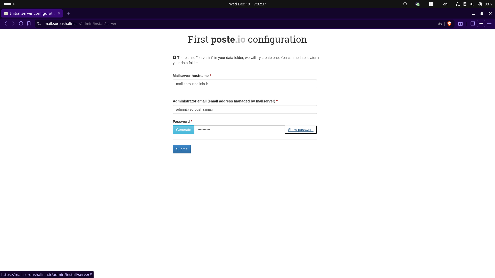
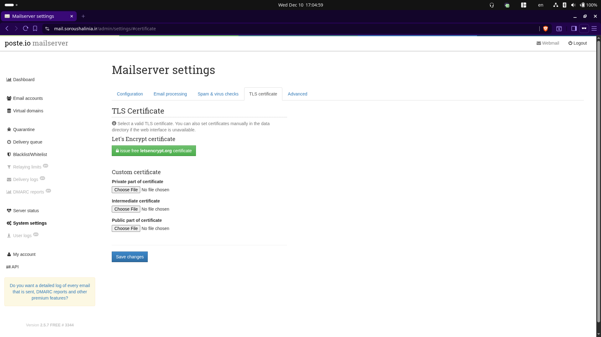
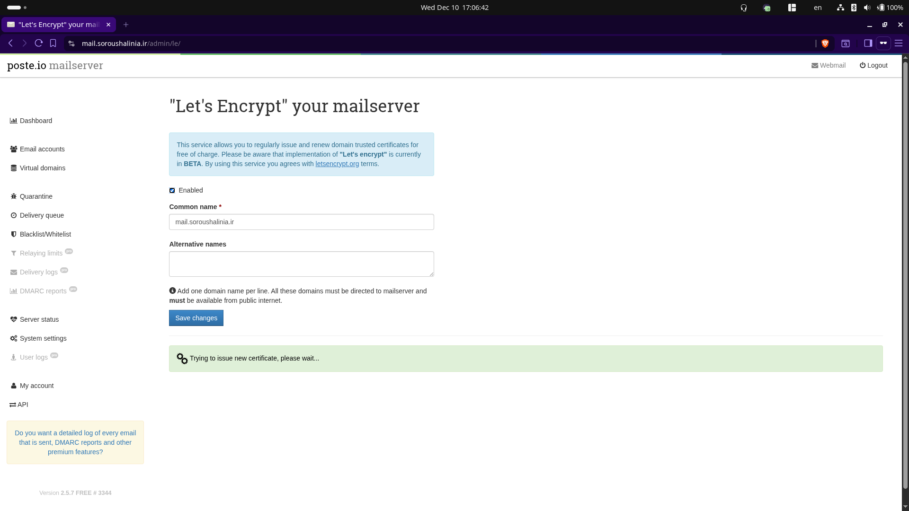
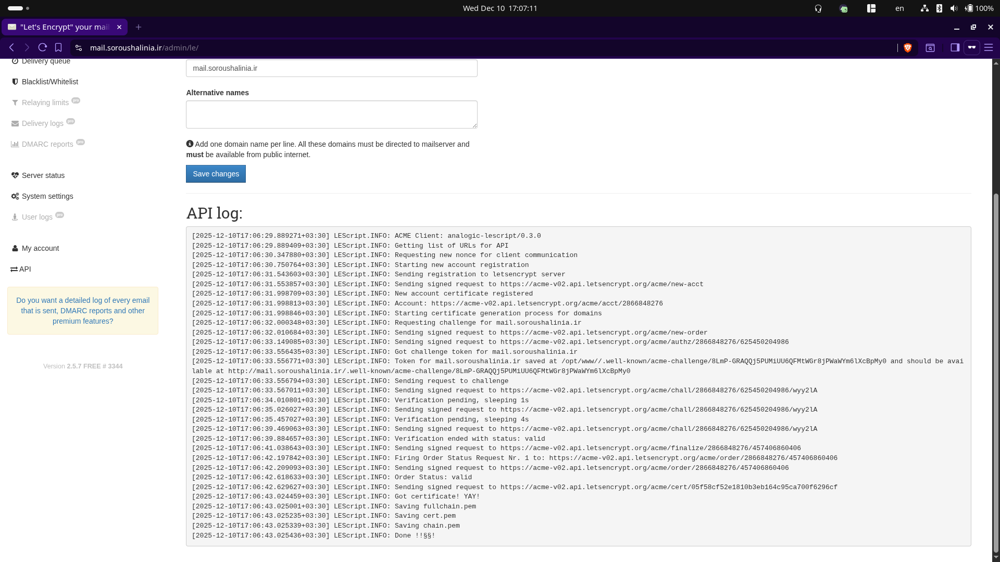

# Infra Template

This repository is a guide to set up a basic infrastructure for common self-hosted services:

- Forgejo (Git Instance)
- Nexus (Artifact Management)
- Keycloak (Identity provider)
- Minio (Object Storage)
- Forgejo runner (CI/CD)
- Poste (Mail server)
- LDAP
- LDAP Account Manager
- Nginx as reverse proxy
- S3Console (Alternative to new minio console)


# How to install and set up

## DNS Records

Many of the services are expected to be exposed through ports that are not 80/443:

- LDAP `ldap.example.com` (Port: 636)
- Mailserver `mail.example.com` (Ports: 25/465/587/993)
- Minio `minio.example.com` (Port: 9000)

For any other subdomains besides these, if you are using a DNS provider that supports CDN and hides the real origin, you can use that option. For the three services above the IP must point directly to the actual server.

Create A records for these subdomains and point them to your server IP. For any service other than those three, you can enable the proxy/CDN option if your provider supports it.

- git (Forgejo)
- nexus (Nexus)
- minio (Minio)
- keycloak (Keycloak)
- mail (Poste mail server)
- ldap (LDAP server)
- lam (LDAP Account Manager)
- s3console (S3 Console for minio)

## Certificates

This repository assumes you use Cloudflare as the DNS provider and Certbot to generate certificates.

The `nginx` container expects the certificates to be pre-generated before runtime and mounts `/etc/letsencrypt:/etc/letsencrypt:ro` so the configuration can use the generated certificates.

To generate and renew certificates without serving HTTP challenges from nginx, this guide uses the Certbot DNS challenge method. 

>You can use any method depending on the DNS provider you use.

Assuming your server is Debian/Ubuntu based, install Certbot and the Certbot DNS Cloudflare plugin:

```shell
sudo apt install certbot python3-certbot-dns-cloudflare
```

In order for the plugin to work you need to generate an API key in Cloudflare with the following permissions:

```
Zone → DNS → Edit
Zone → Zone → Read
```

Next you need to create a file with the given API token for the plugin to use:

```
sudo mkdir -p /etc/letsencrypt
sudo mkdir /etc/letsencrypt/cloudflare
```

Create and open the file with nano (or your preferred editor):
```
sudo nano /etc/letsencrypt/cloudflare/cloudflare.ini
```

And put the following content inside:

```
dns_cloudflare_api_token = <YOUR-TOKEN-HERE>
```

> Replace `<YOUR-TOKEN-HERE>` with the actual token Cloudflare generated.

Then set proper permissions for the file:
```
sudo chmod 600 /etc/letsencrypt/cloudflare/cloudflare.ini
```

Now you can generate certificates for every subdomain required:

```
sudo certbot certonly \
  --dns-cloudflare \
  --dns-cloudflare-credentials /etc/letsencrypt/cloudflare.ini \
  --dns-cloudflare-propagation-seconds 90 \
  -d example.com \
  -d *.example.com \
  --email <your email> --agree-tos --no-eff-email
```

This command creates a wildcard certificate; however it's suggested to generate all subdomains separately as the nginx configuration in the repo expects it. 

> For demonstration purposes I'm using my own domain to keep things simple, but replace `soroushalinia.ir` with your own domain.


```
sudo certbot certonly \
  --dns-cloudflare \
  --dns-cloudflare-credentials /etc/letsencrypt/cloudflare/cloudflare.ini \
  --dns-cloudflare-propagation-seconds 90 \
  -d keycloak.soroushalinia.ir \
  -d git.soroushalinia.ir \
  -d nexus.soroushalinia.ir \
  -d minio.soroushalinia.ir \
  -d mail.soroushalinia.ir \
  -d ldap.soroushalinia.ir \
  -d lam.soroushalinia.ir \
  -d s3console.soroushalinia.ir \
  --email <email> --agree-tos --no-eff-email
```

This generates the certificates required for nginx.

## Preparing docker images

Clone the repository and pull and prebuild images in the compose file:

```
git clone https://github.com/soroushalinia/infra-template
cd infra-template
docker compose pull
docker compose build
```

## Setting up nexus secret key

Nexus will warn when the default encryption key is used. docker-compose expects a secrets file at `./nexus-secrets.json` that is mounted into the container via `NEXUS_SECRETS_KEY_FILE=/nexus-data/etc/keys/nexus-secrets.json` volume. However you need to generate this key and put it into a json file:

```
openssl rand -base64 32
```
And replace the secret key into the json file:

```json
{
  "active": "infra-template-key",
  "keys": [
    {
      "id": "infra-template-key",
      "key": <nexus-secret-key>
    }
  ]
}
```
This will generate the key and you won't get a nexus warning anymore. However the nexus still crashes due to permission error.

So you need to run following command to set proper permission:

```
docker compose run --rm --user root nexus sh -c 'chown -R 200:200 /nexus-data'
```

> This runs nexus container before all the other containers so you won't have issue when you run `docker compose up -d`. However as nexus is dependant on the keycloak 

## Starting the services

Now you can use `docker compose up -d` to bring up all the services.

Check if there is any issue or service not starting:

```
docker compose ps
```
### Notes

> `minio-init` is one time only service to generate the bucket.

> Forgejo runner might fail since the token is not yet generated however it will be explained once Forgejo itself has been set up properly.

## Mail Server (Poste)

First you need to generate the admin account for the mail server. Once you visit mail subdomain you will be taken to initial setup:



### Certificate

In order to use SMTP with TLS on port 465 you need to generate a certificate. From the side panel choose `System settings` and go to `TLS certificate` tab:



Click on the green button and in the next page your common name should be your domain with mail subdomain.

Choose enabled and then save changes and you will see a box trying to generate a certificate. 

And once its done either failed or successful you will see the logs.




### DNS Records

Three DNS records are required for the email to work properly:

- DMARC
- SPF
- DKIM

For DMARC create a TXT Record in cloudflare with name `_dmarc` and put the following content:

```
v=DMARC1; p=none; rua=mailto:dmarc@example.com
```

> Replace the domain with your own

> TTL can be set to auto

For SPF you need to use your actual server IP. Create another TXT record with name `example.com` or your domain.

TXT content is:

```
"v=spf1 ip4:<server ip v4> ~all"
```

For DKIM you need to generate a key and poste will tell you what to put inside the TXT record and it's name.


Go to virtual domains from sidebar and you will reach a screen like this:


Click on your domain to open domain settings:


Click on the generate new key to generate DKIM key and it will be in following format:

```
<name>. IN TXT "<content>"

```

Once you've added all three records your mail server is ready.

Create the noreply email with the address and password you've put inside the `.env` file and Forgejo email should work now.


> I've generated the user in Forgejo beforehand so the email would work.

## Forgejo

There is not much to set up here for now. To generate the admin account you should sign up, and the first user to sign up will become the admin user.

### Forgejo runner

In order to register the runner you need a token since for the time being the container just restarts unless you've stopped it yourself. 

From the top right corner choose Site administration from the profile menu then go to Actions > Runner:


By Clicking on the Create new runner button forgejo gives you a token that you should copy and paste it into `.env` file and recreate the runner container:

```
docker compose down forgejo-runner
docker compose up forgejo-runner -d
```

Then you should see your runner being registered and idle:


> We will test runner later once Nexus is set up.

> This runner has a custom image and uses `dind` (Docker in docker) image to isolate runners from docker instance run inside the host which provides security advantage.

```
dind:
    image: docker:29.1.2-dind
    privileged: true
    environment:
      DOCKER_TLS_CERTDIR: ""
    command: ["--host=tcp://0.0.0.0:2375"]
    volumes:
      - dind_storage:/var/lib/docker
    restart: unless-stopped
```

The following config is used to set up the `dind` image and expose it to the runner service using the following variable:

```
DOCKER_HOST: tcp://dind:2375
```

This docker instance is internal and not exposed outside of the docker network.

## Nexus

Nexus does not require any additional setup at the moment. 

The default admin user is `admin`. Run this to get the first-time password, which you'll be prompted to change upon first login:

```
docker compose exec -it nexus cat /nexus-data/admin.password
```
Email and LDAP configuration will be done in later sections.

## Keycloak

The admin credentials are inside the `.env` file and you can use them to log in; however you will be prompted to create a new admin and remove the current admin for security purposes. Create a new account, and from the credentials tab set a password for your account. Make sure to set the email to verified since we will use it to test the mail server connection. 

To make the new account admin go to the Role mapping tab and assign required roles to make your new account admin. Log out and you should have admin access using the new account.

For SSO we need to create a new realm that handles SSO and we need to do it now since before that we need to set up the email server as well.

Head to Manage Realm from sidebar and create a new realm with the name you want for your organization.

In this guide I've chosen the name `infra`.

## Configuring email on services

### Forgejo

By default Forgejo expects that the no reply email is created and preconfigured to work with that email.

In order for Forgejo to work and send email you need to create the email address with the same password set in these variables:

- `FORGEJO_MAIL_USER`
- `FORGEJO_MAIL_PASSWORD`

This email can also be used for Nexus and Keycloak, which will be mentioned in the next section.

### Nexus

Nexus supports sending emails and can be easily configured to use our email setup to send emails.

Go to:

```
Settings > system > Email server
```
This page is also available at following path:

```
https://nexus.example.com/admin/system/emailserver
```

Following settings are required for the email server to work:


- Enable Email Server: `true`
- Host: `mail.example.com`
- Port: `465`
- Use the Nexus Repository Truststore: `true` (However you have the option to add your certificate to nexus trust store)
- Username: `no-reply@example.com`
- Password: no reply email password
- From address: `no-reply@example.com`
- Subject prefix: You can write any prefix for your email subject

SSL/TLS Options:

- Enable SSL/TLS encryption upon connection: `true`

There is a button and an input field where you can enter another email; by clicking the test button you can verify the email configuration.
It should work and you'll receive an email from Nexus.

### Keycloak

In order to set up email you need to switch to the new realm you created. From the sidebar choose Manage realm and from the realm list click on the new realm you've created and you see the current realm change to what you have selected.


Under the template part you have a from field, which is the email address that will use the no reply email address.

Under connection and authentication set host to `mail.example.com` and the port is again 465. Activate `Enable SSL` and toggle authentication. 

Enter the username and password for the no reply email and before saving use the test connection option to verify your settings; you'll receive an email to the email you've entered for your admin account.


## LDAP Config

LDAP is configured and works properly by default and can be connected at `ldaps://ldap.example.com`

In order to use Keycloak and Nexus with LDAP you need to set up a new organizational unit named `users` so Keycloak can work properly. 

You can use the CLI if necessary but LDAP Account Manager is also available at `lam.example.com`

All you need to do is enter the LDAP password and log in.

From the top section choose tools and go to OU Editor:


It is also accessible from this path:

```
https://lam.example.com/lam/templates/tools/ou_edit.php
```
On the input field from the New organizational unit create a unit named `users` and save it.

Now keycloak can use it to handle new users.

> Since the LDAP server is also accessible from outside, and the cert name needs to match the actual hostname, even internal services are configured to use the full LDAP domain despite being internal. 

> LDAP certificates are generated by certbot but are also configured so renewal works.

## Keycloak and SSO

### Keycloak LDAP Federation

> For the moment we have not connected to ldap so once you create a new user and ldap is not connected the new user won't be available inside ldap.

In order to connect the realm to ldap, go to user federation from the side bar and choose add ldap provider


It is also available from this link:

```
https://keycloak.example.com/admin/master/console/#/infra/user-federation
```

And for the values use the following:

- UI Display Name: `LDAP`
- Connection URL: `ldaps://ldap.example.com:636`
- Bind Type: `Simple`
- Bind DN: `cn=admin,dc=ldap,dc=example,dc=com`
- Bind credentials: LDAP password

- Edit Mode: `Writable`
- Users DN: `ou=users,dc=ldap,dc=example,dc=com`
- Username LDAP attribute: `uid`
- RDN LDAP attribute: `uid`
- UUID LDAP attribute: `entryUUID`
- User object classes: `inetOrgPerson, organizationalPerson`

Save it and now Keycloak uses LDAP; users can now be shared between Nexus and Forgejo, but you still need to configure Nexus to use LDAP and Forgejo to use OpenID Connect.

### Forgejo

In order to use Forgejo with Keycloak SSO you'll need a client:

From the sidebar of the infra realm go to client and create a new client.


It is also accessible from this URL:

```
https://keycloak.example.com/admin/master/console/#/infra/clients/add-client
```
And the following config is required to work:

General Settings:

- Client ID: `forgejo`
- Always display in UI: `true`

Capability Settings:
- Client authentication: `true`
- Authorization: `true`

Login Settings:
- Root URL: `https://git.example.com`
- Home URL: `https://git.example.com`
- Valid redirect URIs: `https://git.example.com/user/oauth2/keycloak/callback`
- Valid post logout redirect: `https://git.example.com/*`
- Web origins: `https://git.example.com`
- Admin URL: `https://git.example.com`

Now you can save it. But before setting it up in Forgejo you'll need a client secret generated by Keycloak. From the newly created client go to the Credentials tab and copy the client secret:


Head back to Forgejo site administration and go to Identity & access then click on Authentication sources:


This page is also available at this URL:

```
https://git.example.com/admin/auths
```

Then enter the following configuration:

- Authentication type: `OAuth2`
- Authentication name: `keycloak`
- OAuth2 provider: `OpenID Connect`
- Client ID: `forgejo`
- Client Secret: Paste the secret you've copied in previous step
- OpenID Connect Auto Discovery URL:
`https://keycloak.example.com/realms/infra/.well-known/openid-configuration`

The next time you'll try to log in you will see an option to sign in with Keycloak:


### Nexus

Go to your Nexus instance and from the settings go to security and choose LDAP:


It can be accessed from this URL as well:

```
https://nexus.example.com/#admin/security/ldap
```

Click on new connection and use the following settings:

- Name: `LDAP`
- LDAP server address: `ldaps://ldap.example.com:636`
- Use the Nexus repository truststore: `true` (But import the cert as well)
- Search Base DN: `dc=ldap,dc=example,dc=com`
- Authentication method: `Simple Authentication`
- Username or DN: `dc=ldap,dc=example,dc=com`
- Password: LDAP Password

From the User and group tab enter these values:
- User relative DN: `ou=users`
- Object class: `inetOrgPerson`
- User ID attribute: `uid`
- Real name attribute: `cn`
- Mail attribute: `mail`
- Map LDAP group as roles: `true`
- Group type: `Dynamic Groups`
- Group member of attribute: `memberOf`

You can also verify login and user mapping. If all worked, users can log in with the same credentials between Forgejo and Nexus.

In order to see users in the users section change the source from local to LDAP.

## Minio

Minio is preconfigured to work for the backup section. The default panel was recently stripped of most features and put behind a paywall, so a fork of the console is also available at `s3console.example.com`. However the original console is also available at `minio.example.com` and can be used if necessary. The API to use the CLI is also accessible at `minio.example.com:9000`.

`mcli` was used to create a bucket on startup since the backup service requires a bucket to work however you can create another bucket to use.

## Nginx

Nginx is used to reverse proxy external traffic into the docker network. The main configuration lives at `nginx/conf.d/default.conf`, and the container mounts `/etc/letsencrypt` so each server block can load `fullchain.pem` and `privkey.pem` from `/etc/letsencrypt/live/<subdomain>/`. Global headers at the top of the file hide upstream `Server`/`X-Powered-By` banners and each TLS vhost adds HSTS and a CSP.

Service-specific notes:
- Nexus allows large uploads via `client_max_body_size 500M;` (adjust if you expect bigger artifacts).
- Minio/S3 console blocks include `Upgrade`/`Connection` headers to keep console websockets working.
- The mail server uses an ACME location to pass `/.well-known/acme-challenge/` to `mailserver:80` so Poste can mint/renew its own certs.
- Each domain is defined explicitly; edit `nginx/conf.d/default.conf` and reload the container if you change hostnames or need extra headers (for example, custom auth headers).

## Backup 
Backup is scheduled by the backup service; the cron expression comes from `BACKUP_CRON_SCHEDULE` (default `0 2 * * *`) in `.env`. Archives are written inside the container to `BACKUP_DIR` (default `/backup/data`) and then pushed to the Minio bucket named by `MINIO_BUCKET`.

```
docker compose exec backup sh /backup/run_backup.sh
```

`backup/run_backup.sh` dumps the Keycloak and Forgejo PostgreSQL databases, tars Forgejo, Nexus, Poste, and LDAP data/config volumes (mounted read-only from compose), and uploads everything to Minio via the `local` alias pointing at `http://minio:9000`. You can run backups outside the schedule with the command above or by overriding `entrypoint` with `run-once`.

Update `backup/run_backup.sh` if you want to change what is archived or where it lands, then rebuild the image and restart the container.

## Screenshots

